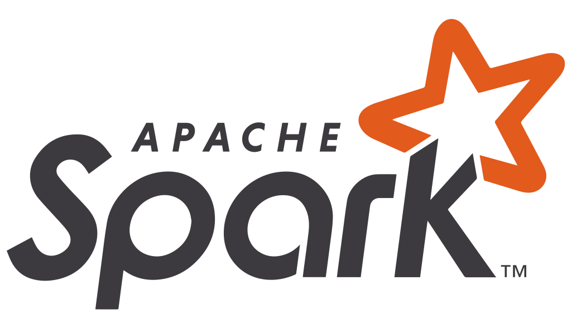
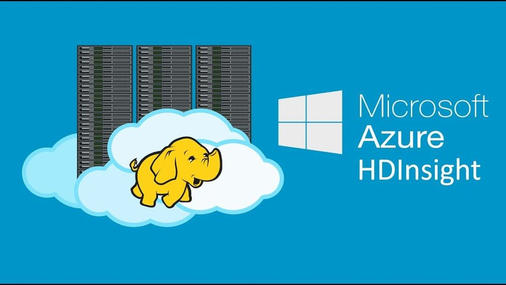

Ferramentas para Big Data
================

 Por Alisson Neimaier e Taiane Schaedler Prass

## Apache Hadoop

 Haddop é uma plataforma de software em Java para computação distribuída e processamento de grandes massas de dados. O Hadoop não é uma ferramenta única, mas sim uma coleção de subprojetos relacionados para computação distribuída, todos eles hospedados pela *Apache Software Foundation*
[(http://hadoop.apache.org/)](http://hadoop.apache.org/), sendo que os mais conhecidos são o MapReduce e o sistema de arquivos distribuídos (HDFS).

É um sistema de armazenamento compartilhado para processamento de grandes volumes de dados através de clusters de computadores (escalabilidade horizontal). O ecossistema Hadoop é composto por 3 módulos principais:

  - **Hadoop Distributed File System** (HDFS):  Responsável pelo armazenamento distribuído.

  - **Hadoop Yarn**: Gerencia os recursos alocados nos clusters, minimizando a sobreposição de uso de recursos de CPU e Memória que são consumidos por outros frameworks presentes no ecossistema hadoop.
  
  - **Hadoop MapReduce**: Modelo de programação para processamento em larga escala. Duas operações são executadas (map e reduce). A função map processa uma série de entradas na forma de chave/valor e gera para cada uma dessas zero ou mais saídas no formato chave/valor. A função de reduce realiza um agrupamento do foi gerado pela função de map podendo gerar um conjunto menor de dados.

MapReduce é um modelo de programação que permite o processamento de dados massivos em um algoritmo paralelo e distribuído que possui duas fases de processamento, Map e Reduce, ambas gerenciadas internamente pelo Hadoop sem intervenção do programador. O HDFS é um sistema de arquivos criado para armazenar arquivos muito grandes de forma
distribuída, escalável e tolerante a falhas. 

Além do MapReduce e do HDFS existem outros subprojetos do Hadoop que oferecem uma série de serviços complementares ou que adicionam abstrações de maior nível. Dentre eles destacam-se:

  - **Avro**: um sistema de serialização de dados que fornece RPCs (*Remote Procedure Calls*) eficientes e independentes de linguagem,     armazenamento persistente de dados, estruturas de dados ricas, entre outros recursos. É muito utilizado com linguagens de programação dinâmicas.

  - **Pig**: uma plataforma para grandes conjuntos de dados que possui uma linguagem de programação de alto nível para realizar a análise desses dados. Possui a infraestrutura necessária para avaliar os programas criados, como um compilador especial que transforma as aplicações desenvolvidas nessa linguagem em uma sequência de programas MapReduce.

  - **HBase**: uma base de dados distribuída, criada para armazenar tabelas muito grandes (milhões de colunas e bilhões de linhas). Trata-se de um modelo de armazenamento orientado a colunas altamente escalável, inserido no contexto de tecnologias NoSQL (*Not Only SQL*).

  - **ZooKeeper**: um serviço centralizado para coordenação de aplicações distribuídas. Mantém informações de configuração das aplicações distribuídas, além de fornecer a sincronização das mesmas.

  - **Hive**: uma espécie de Data Warehouse distribuído, que facilita a utilização de grandes conjuntos de dados em ambientes de armazenamento paralelo. Provê uma linguagem baseada em SQL, chamada HiveQL, que facilita a estruturação e pesquisa dos dados.
    
Algumas ferramentas complementares são: Sqoop, Oozie, Mahout, Flume, etc. Uma descrição dessas ferramentas pode ser encontrada em [https://rogeraoaraujo.com.br/2020/11/12/big-data-ferramentas-e-tecnologias-parte-2/](https://rogeraoaraujo.com.br/2020/11/12/big-data-ferramentas-e-tecnologias-parte-2/)    

## Apache Spark

 Originalmente, foi desenvolvido no laboratório AMPLab, da Universidade da Califórnia, Berkeley. Mais tarde seu código fonte foi doado para a *Apache Software Foundation* [https://spark.apache.org/](https://spark.apache.org/), que o mantém desde então. É uma ferramenta voltada para o processamento de  grandes conjuntos de dados (larga escala) de forma paralela e distribuída. É possível fazer análise em bancos de dados “quase” instantaneamente (Stream Processing) ou em dados que já foram coletados a mais tempo (Batch Processing).

A forma como o Spark Streaming funciona é dividindo o streaming em lotes (chamados micro lotes) em um intervalo predefinido ($N$ segundos) e, em seguida, trata cada lote de dados como arquivos *Resilient Distributed Datasets* (RDDs). Sua base é o Hadoop HDFS, mas pode ser usado com Cassandra, HBase e MongoDB, também com as linguagens R, Python e Scala. 

O Spark estende o modelo de programação MapReduce, chegando a ser 100x mais rápido em memória e 10x em disco. Uma das vantagens em relação ao Hadoop é que todos os componentes funcionam integrados na própria ferramenta. O Spark Core é o componente que disponibiliza as funções básicas para o processamento como as funções map, reduce, filter e collect. Dentre os demais componentes (cada um voltado para um tipo de processamento) destacam-se

  - **Spark Streamming**: possibilita o processamento de fluxos em tempo real

  - **GraphX**: realiza o processamento sobre grafos
  
  - **SparkSQL**: para a utilização de SQL na realização de consultas e processamento sobre os dados no Spark
  
   - **MLlib**: biblioteca de aprendizado de máquina, com deferentes algoritmos para as mais diversas atividades, como clustering.

Além disso, é possível desenvolver API’s (Interface de Programação de Aplicativos) em Java, Scala, Python e R. 

Para mais detalhes veja, por exemplo, [https://www.devmedia.com.br/introducao-ao-apache-spark/34178](https://www.devmedia.com.br/introducao-ao-apache-spark/34178)

## Microsoft Azure HDInsight

 Azure HDInsight ([https://azure.microsoft.com/en-us/services/hdinsight/](https://azure.microsoft.com/en-us/services/hdinsight/)) é uma distribuição em nuvem de componentes do Hadoop. Disponibiliza diversas ferramentas para tornar o processamento de grandes volumes de dados mais fácil, rápido e econômico. Permite a utilização de estruturas de código aberto como Hadoop, Spark, Hive, LLAP, Kafka, Storm, R entre outras. 

Nesse link você encontra uma lista das ferramentas/produtos disponibilizadas sem custo: [Microsoft Azure](https://tinyurl.com/y62wufmd) 

## Outras Ferramentas

  -  **MongoDB:**  é desenvolvido pela MongoDB Inc. e licenciado sob a Server Side Public License (SSPL). O MOngoDB é um banco de dados open source, classificado como NoSQL, orientado a documentos. Armazena documentos num formato parecido com json.  <https://en.wikipedia.org/wiki/MongoDB>
  
  - **Plotly:** é uma plataforma que fornece bibliotecas com gráficos dinâmicos e um ambiente clould para compartilhamento. Através de um ambiente studio é possível salvar e editar seus gráficos na nuvem. As biblioteca estão disponíveis em  modo online ou offline. No modo online os gráficos ficarão armazenados na cloud da plataforma e você pode acessar, editar e compartilhar com outros usuários. O plano gratuito oferece recursos limitados de gráficos com permissão publica armazenados. O cadastro pode ser feito em <https://chart-studio.plotly.com/Auth/login/#/>
  
  - **Google Analytics:** O Google Analytics é um serviço oferecido de forma gratuita pelo Google. Essa ferramenta exibe estatísticas de visitação de sites.
  
  - **Ferramentas (pagas) voltadas para visualização de dados:**  Lumify, Periscope/Sisense, Looker, Zoho Analytics, Yellowfin BI, Domo,  IBM Cognos Analytics.

## Machine Learning Libraries

Spark (MLib): <https://spark.apache.org/docs/latest/ml-guide.html>

Flink (FlinkML): <https://ci.apache.org/projects/flink/flink-docs-release-1.12/>

Samoa: Conjunto de algoritmos para data mining e machine learning em “tempo real”. É possível desenvolver outros algoritmos. Roda em Apache Storm,
S4, Samza e Flink. <https://samoa.incubator.apache.org/documentation/Home.html>

## Leituras Indicadas

Comparação MongoDB vs Hadoop: <https://data-flair.training/blogs/hadoop-vs-mongodb/> 

Tabela comparativa dos Frameworks Apache (Hadoop, Spark, etc.): <https://i2.wp.com/opensourceforu.com/wp-content/uploads/2018/03/Table-1-Comparison-of-teh-best-Big-Data-frameworks-2.jpg?ssl=1>

Big Data Analytics Technologies and Platforms: a brief review: <https://www.researchgate.net/publication/329239211_Big_Data_Analytics_Technologies_and_Platforms_a_brief_review> 

  

## **Referências**

1.  20 Best Data Analytics Software for 2020  
    <https://financesonline.com/data-analytics/>

2.  11 Best Big Data Analytics Tools in 2020  
    <https://www.guru99.com/big-data-analytics-tools.html>

3.  Top 53 Bigdata Platforms and Bigdata Analytics Software  
    <https://www.predictiveanalyticstoday.com/bigdata-platforms-bigdata-analytics-software/>
