Tutorial de Java
================
Taiane S. Prass

<div style="float:right; padding:100px">

<p style="float: left;">
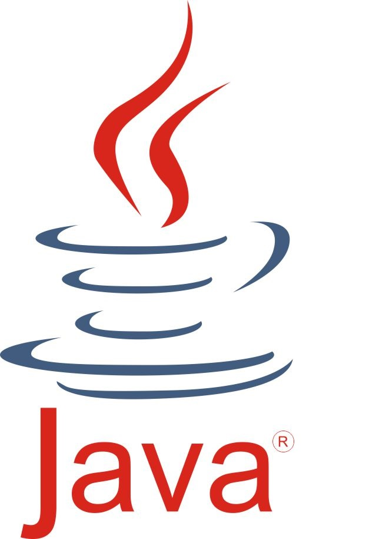
</p>

Este é um tutorial de Java voltado para iniciantes. Nele vamos discutir
conceitos básicos relacionados à programação em Java.

<p>
</p>

O tutorial é baseado no vídeo [Java Programming All-in-One Tutorial
Series (6 HOURS!)](https://www.youtube.com/watch?reload=9&v=r3GGV2TG_vw)

</div>

# Motivação

Java é uma linguagem de programação orientada a objetos desenvolvida na
década de 90. Atualmente, é uma das linguagem de programação mais
populares. Uma das grandes vantagens do Java em relação a outras
linguagens de programação modernas é o fato da linguagem Java ser
compilada para um *bytecode* que é interpretado por uma máquina virtual
(*Java Virtual Machine* - JVM). Dessa forma, aplicativos escritos nessa
linguagem podem rodar em diferentes plataformas (Windows, MAC, Linux)
com pouco trabalho.

## Arquitetura do Java

<div style="float:right; padding:1px">

<p style="float: left;">
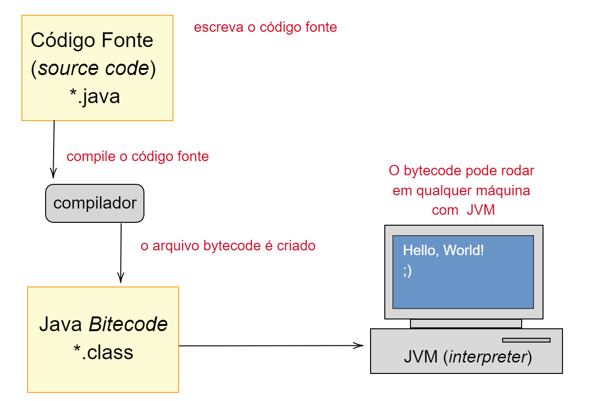
</p>

Escrevemos um código, isto é, uma série de comandos que dizem ao
computador o que fazer. Esse código (*source code*) é salvo em um
arquivo com extensão “.java”.

O código é então compilado em algo conhecido como *bytecode*. O arquivo
gerado nessa etapa terá a extensão “.class”

O *bytecode* pode ser executado em qualquer sistema operacional:
Windows, MAC, Linux.

</div>

## Qual é a mágica por trás disso?

O JDK (*Java Development Kit*), é um conjunto de ferramentas para
programação em java. O JRE (*Java Runtime Environment*) é um conjunto de
componentes para criar e executar aplicações Java. Os componentes do JRE
incluem a máquina virtual Java (JVM), bibliotecas de classe Java e o
carregador de classes Java.

Os JDKs são usados para desenvolver softwares Java, os JREs oferecem
ferramentas de programação e tecnologias de implantação, e as JVMs
executam programas nessa linguagem.

**Observação:** As constantes atualizações do Java em seu computador
servem para atualizar o JRE.

Download:

-   JDK:
    <https://www.oracle.com/java/technologies/javase-downloads.html>

-   JRE: <https://www.java.com/pt-BR/download/>

# Primeiro Programa em Java

Faça o download do JDK e instale conforme as instruções.

Precisaremos também de um IDE (*Integrated Development Environment* ou
Ambiente de Desenvolvimento Integrado) que é um programa de computador
que reúne características e ferramentas de apoio ao desenvolvimento de
software com o objetivo de agilizar este processo. Os IDE mais
utilizados são **eclipse** (<https://www.eclipse.org/ide/>) e
**netbeans** (<https://netbeans.org/>). Para esse tutorial vamos
utilizar o eclipse.

**Criando o projeto**

Para criar um novo projeto, siga os passos das figuras abaixo:

<div style="float:center; padding:1px">

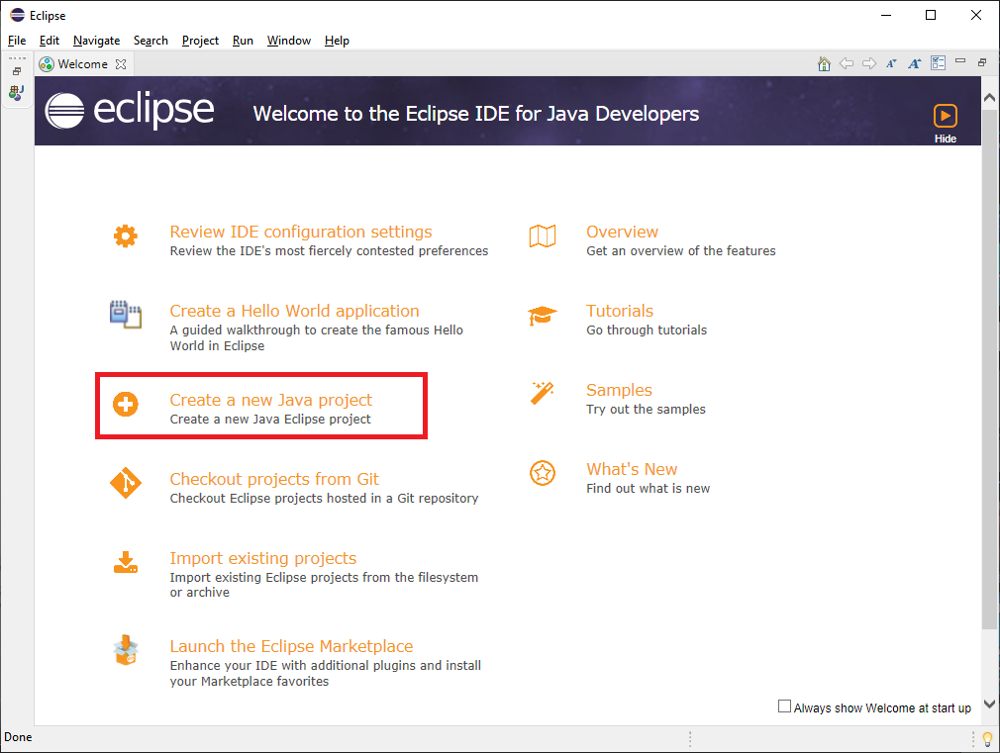

</div>

<div style="float:center; padding:1px">

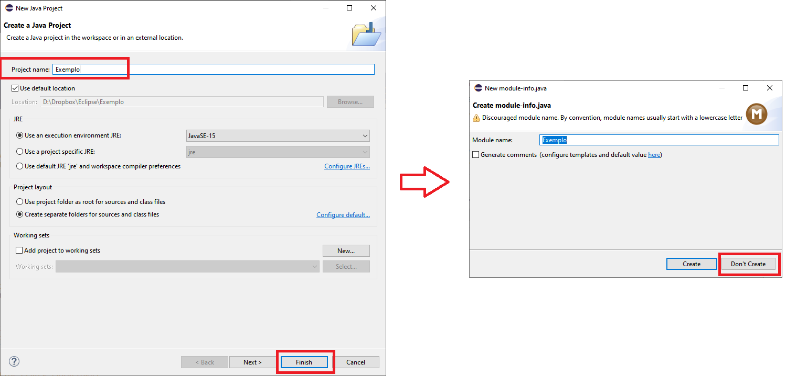

</div>

**Observação:** Caso apareça uma mensagem de erro do tipo (aconteceu
comigo)

> *The project was not built due to “Failed to init ct.sym for
> C:\\Users\\…\\jrt-fs.jar” Fix the problem, then try refreshing this
> project and building it since it may be inconsistent*

veja as sugestões nessa página:
<https://stackoverflow.com/questions/63446925/the-project-was-not-built-due-to-failed-to-init-ct-sym-for-c-program-files-jav>

Se não ocorrer nenhum problema, seguindo os passos das figuras acima
você chegará nessa tela:

<div style="float:center; padding:1px">

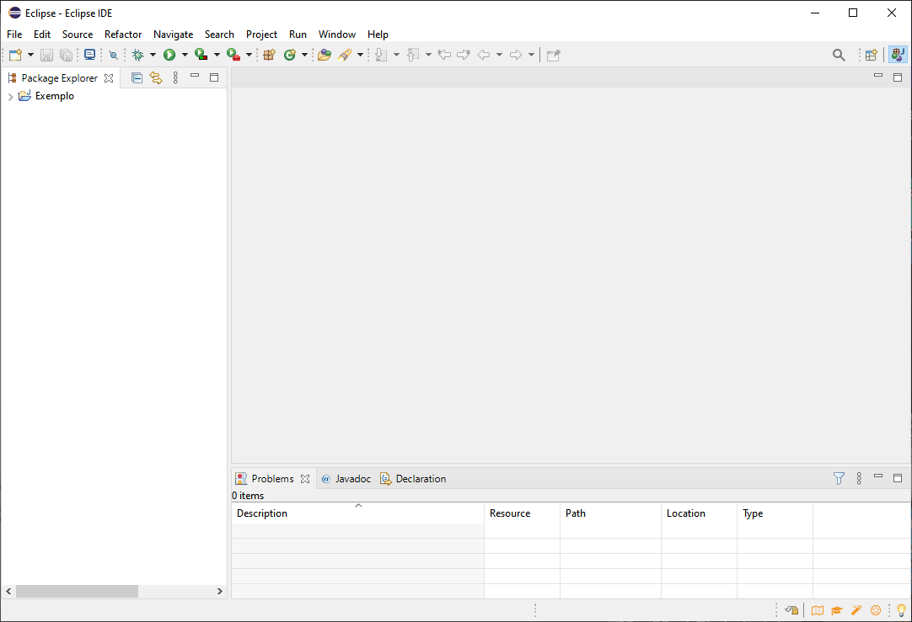

</div>

**Criando uma classe**

O próximo passo será criar uma nova classe, clicando com o botão direito
do mouse em cima do projeto e selecionando os menus como na figura
abaixo:

<div style="float:center; padding:1px">

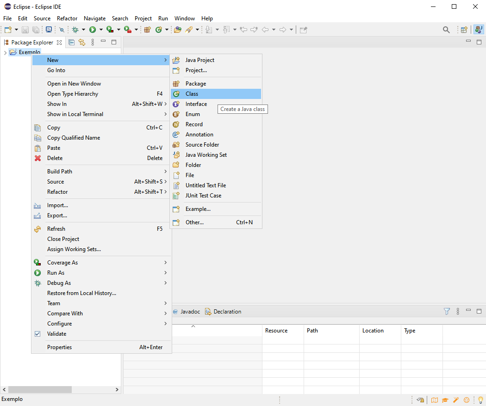

</div>

A figura abaixo apresenta a janela que aparecerá em seguida. Não esqueça
de marcar a caixa indicada na figura (*public static void main*) pois
essa opção indicará onde o aplicativo deve iniciar. Preencha também com
o nome de sua preferência (neste exemplo, *MeuPrimeiroPrograma*).

<div style="float:center; padding:1px">

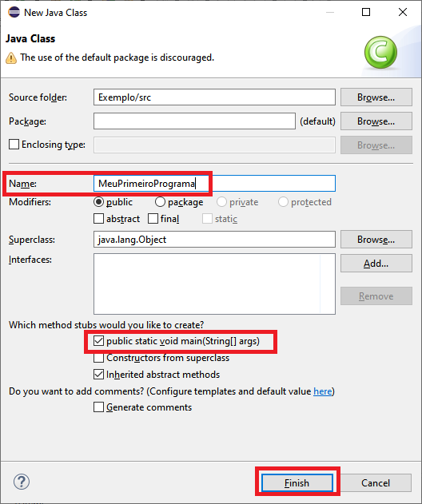

</div>

O resultado desse procedimento é apresentado na figura abaixo. O código
que aparece foi gerado automaticamente.

<div style="float:center; padding:1px">

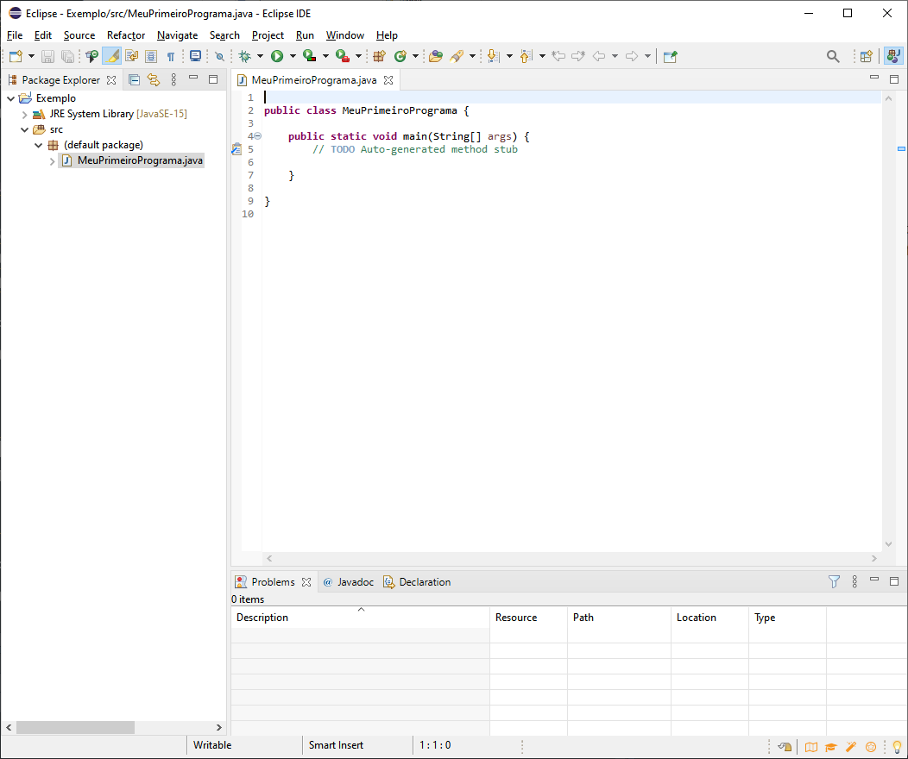

</div>

**Criando o primeiro programa**

Vamos substituir a linha que contém comentários (linha que começa com
duas barras)

``` js
// TODO Auto-generated method stub
```

pelo comando para imprimir a mensagem “Olá Pessoal!”

``` js
System.out.println("Olá Pessoal!");
```

Em seguida basta salvar (Ctrl+s) e executar (botão indicado na figura
abaixo). O resultado aparecerá no console (parte inferior da janela).

<div style="float:center; padding:1px">

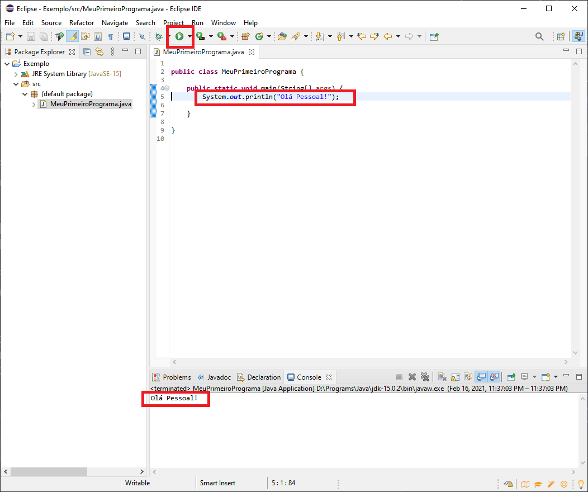

</div>

## Entendendo o código

A primeira coisa que precisamos saber é que tudo está dentro de uma
**classe** e cada classe tem um nome. No código criado anteriormente, a
classe foi denominada *MeuPrimeiroPrograma*.

``` js
public class MeuPrimeiroPrograma {
   ...
}
```

Dentro das classes temos os **métodos**.Assim como as classes, todos os
métodos tem um nome. Abaixo o método, cujo nome é *main*, que consta no
programa que escrevemos.

``` js
...
    public static void main(String[] args) {
  ...
    }
...
```

Dentro dos métodos, excutamos **declarações/instruções** (*statements*).
No caso do nosso programa, a declaração correponde à linha onde dizemos
para o programa imprimir a mensagem “Olá Pessoal!”.

``` js
...
        System.out.println("Olá Pessoal!");
...
```

O termo técnico para o “nome” da classe/método é **identificador**
(*identifier*). Tudo o que está dentro de uma classe é denominado
**membro** (*member*), ou seja, o método *main* é um membro da classe
*MeuPrimeiroPrograma*. Abaixo acrescentamos mais um membro à classe que
estamos trabalhando:

``` js
public class MeuPrimeiroPrograma {

    public static void main(String[] args) {
        System.out.println("Olá Pessoal!");
    }
    
    String x = new String(); 

}
```

Agora nossa classe é composta de um método (*main*) e de uma *string*
chamada “x”. Uma *string* é um exemplo de **propriedade** (*property*).
Métodos geralmente fazem alguma coisa (nesse exmemplo é imprimir no
console) enquanto que propriedades armazenam algum valor. Por exemplo,
podemos armazenar o valor “hello” como mostrado abaixo

``` js
public class MeuPrimeiroPrograma {

    public static void main(String[] args) { //methods
        System.out.println("Olá Pessoal!");
    }
    
    String x = new String("hello"); //property

}
```

No código que estamos escrevendo conseguimos visualizar o conceito de
“aninhamento” (*nesting*). Por exemplo, para a declaração

``` js
...
        System.out.println("Olá Pessoal!");
...
```

temos uma classe denominada **System**. Acessamos os membros dessa
classe utilizando o **ponto**. Um dos membros de *System* é chamado
**out**. Por sua vez, *out* possui um membro denominado **println** que
é um método.

Vamos focar novamente no código original:

``` js
public class MeuPrimeiroPrograma {

    public static void main(String[] args) { //methods
        System.out.println("Olá Pessoal!");
    }
}
```

O termo **public** é um modificador de acesso (*access modifier*). Outro
modificador desse tipo é **private**. Nesse programa obteríamos um erro
trocando o *public* do método *main* por *private* pois todo programa
executável de java deve ter um método do tipo *public* denominado
*main*. Modificadores de acesso determinam quem pode acessar o
método/classe em questão.

As chaves funcionam como uma “caixa” que delimita o que faz parte do
método/classe em questão (classe ou método). Apenas por convenção (pois
ajuda na visulização e entendimento do código) identificamos tudo que
está entre chaves.

O uso da palavra chave **static** é um pouco mais difícil de explicar.
Para entender o que ela faz precisamos ter um pouco mais de conhecimento
em programação orientada à objeto (falaremos mais sobre isso na
sequência). Vamos então explicar aqui de maneira resumida e informal.

Em programação orientada à objetos criamos instâncias de classes. Uma
classe funciona como uma “fábrica” de objetos. O que a palavra *static*
diz é que não precisamos criar uma instância para usar o método *main*
que está dentro da classe *MeuPrimeiroPrograma* que criamos
anteriormente.

Poderíamos criar um método diferente, sem o uso de *static*, como no
exemplo abaixo,

``` js
 public class MeuPrimeiroPrograma {
  
    public static void main(String[] args) { //methods
        System.out.println("Olá Pessoal!");
    }
    
    public void algoDiferente() { //methods
        System.out.println("Olá Diferente!");
    }
  }
```

Nesse caso, se quisermos rodar o método *algoDiferente* ou invocar ele
precisamos incluir os comandos abaixo

``` js
...
      var x = new MeuPrimeiroPrograma();
        x.algoDiferente();
...     
```

então, quando rodarmos a aplicação, o método será executado, como mostra
a figura abaixo

<div style="float:center; padding:1px">

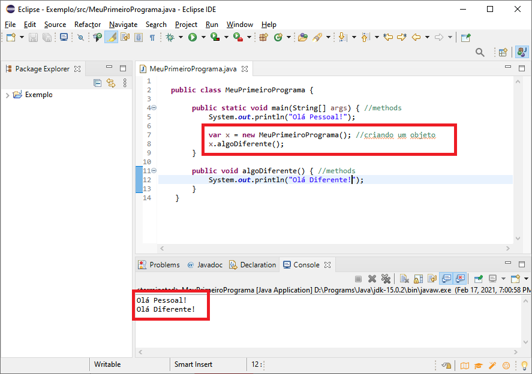

</div>

Quando usamos *new* e escrevemos o nome da classe, estamos criando um
objeto. Como o método *main* tem a palavra chave *static*, esse passo de
criar o objeto não precisa acontecer para ele. Isso é similar ao uso do
método *println* no sentido que, para utilizá-lo não criamos uma
instância do *System* usando *new*, dando a ela um nome de variável e
depois invocando *println*. Ao invés disso, estamos invocando o
*println* diretamente. Isso é possível devido à palavra chave *static*.
Veja como ficaria o código e o resultado se tivéssemos usado *static* ao
definir o método *algoDiferente*:

<div style="float:center; padding:1px">

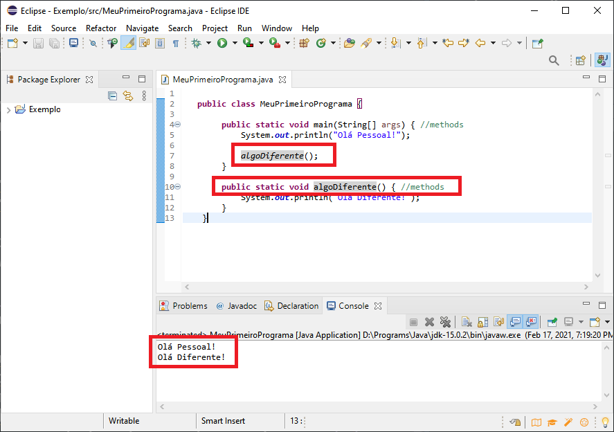

</div>

## Resumo da Seção - Palavras chave

-   duas barras “//” são usadas para criar comentários que são ignorados
    pelo compilador.

-   uma **classe** contém “tudo” - possui **membros**.

-   uma **declaração** diz ao computador para fazer algo.

-   exemplos de membros são **métodos** (que fazem algo) e
    **propriedades** (que guardam algo).

-   a função **main** sempre é executada automaticamente quando rodamos
    o programa. Se não tivermos uma função *main* receberemos uma
    mensagem de erro.

-   os membros podem receber **modificadores de acesso** (por exemplo,
    **public**) que definem “quem” pode utilizar eles.

-   **static** indica que não é necessário uma instância da classe.

-   um **objeto** é uma instância de uma classe.
