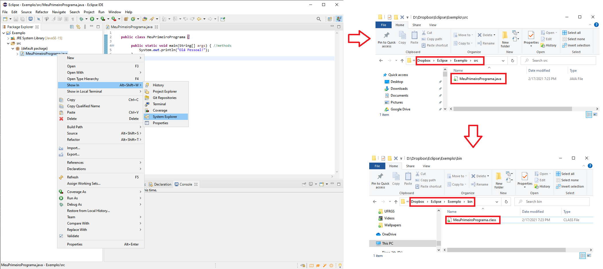
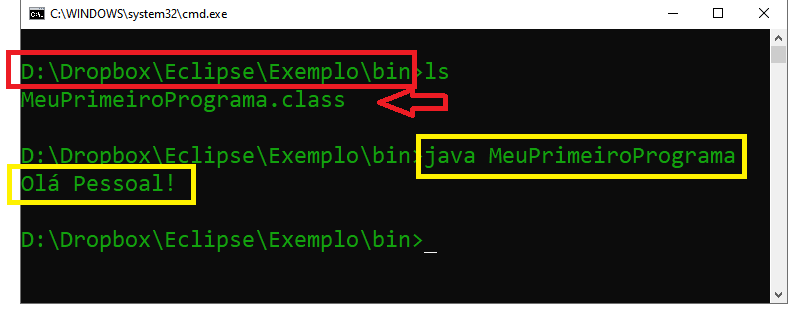
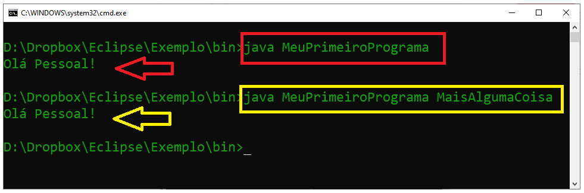
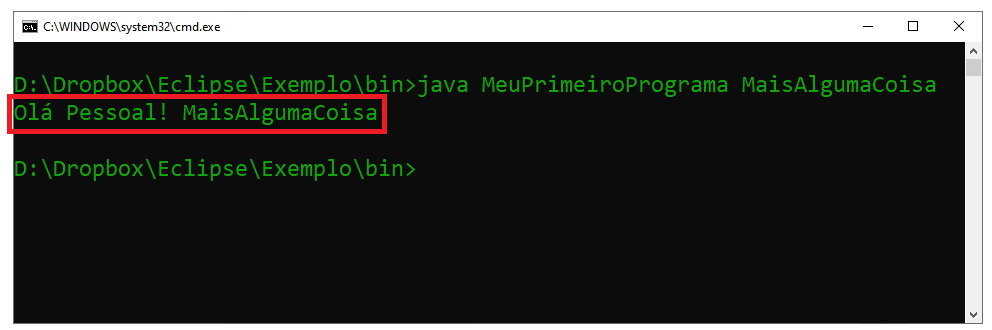
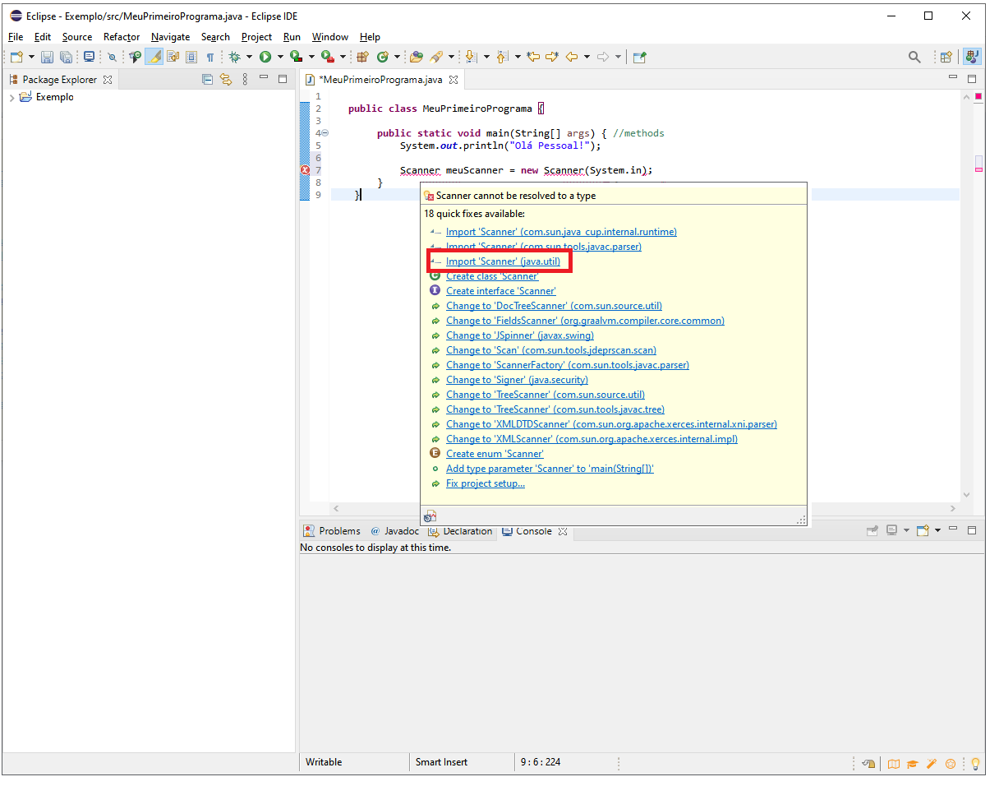
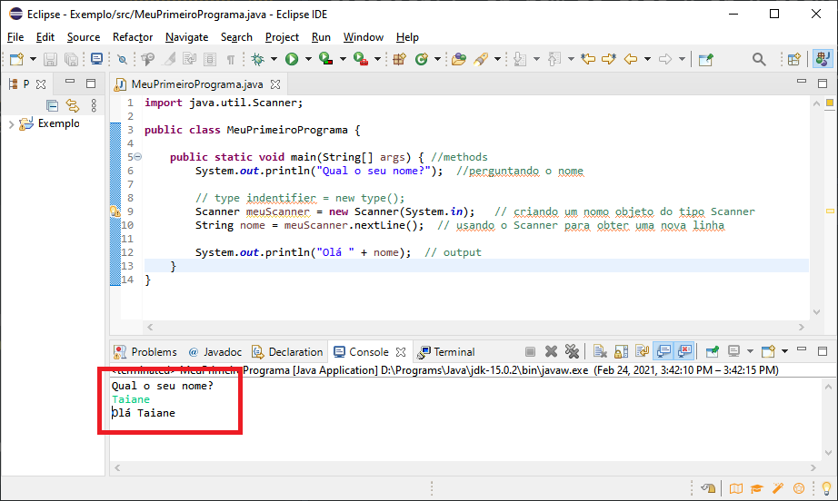

Tutorial de Java
================
Taiane S. Prass


-   [Motivação](#motivação)
    -   [Arquitetura do Java](#arquitetura-do-java)
    -   [Qual é a mágica por trás
        disso?](#qual-é-a-mágica-por-trás-disso)
-   [Primeiro programa em Java](#primeiro-programa-em-java)
    -   [Criando o projeto](#criando-o-projeto)
    -   [Criando uma classe](#criando-uma-classe)
    -   [Finalizando e executando](#finalizando-e-executando)
-   [Entendendo o código do primeiro
    programa](#entendendo-o-código-do-primeiro-programa)
-   [Argumentos e Parâmetros](#argumentos-e-parâmetros)
-   [Pacotes](#pacotes)
-   [Tipos de variáveis](#tipos-de-variáveis)
-   [Resumo - Palavras chave](#resumo---palavras-chave)


<div style="float:right; padding:100px">

<p style="float: left;">

</p>

Este é um tutorial de Java voltado para iniciantes. Nele vamos discutir
conceitos básicos relacionados à programação em Java.

<p>
</p>

O tutorial é baseado no vídeo [Java Programming All-in-One Tutorial
Series (6 HOURS!)](https://www.youtube.com/watch?reload=9&v=r3GGV2TG_vw)

</div>

# Motivação

Java é uma linguagem de programação orientada a objetos desenvolvida na
década de 90. Atualmente, é uma das linguagem de programação mais
populares. Uma das grandes vantagens do Java em relação a outras
linguagens de programação modernas é o fato da linguagem Java ser
compilada para um *bytecode* que é interpretado por uma máquina virtual
(*Java Virtual Machine* - JVM). Dessa forma, aplicativos escritos nessa
linguagem podem rodar em diferentes plataformas (Windows, MAC, Linux)
com pouco trabalho.

## Arquitetura do Java

<div style="float:right; padding:1px">

<p style="float: left;">

</p>

Escrevemos um código, isto é, uma série de comandos que dizem ao
computador o que fazer. Esse código (*source code*) é salvo em um
arquivo com extensão “.java”.

O código é então compilado em algo conhecido como *bytecode*. O arquivo
gerado nessa etapa terá a extensão “.class”

O *bytecode* pode ser executado em qualquer sistema operacional:
Windows, MAC, Linux.

</div>

## Qual é a mágica por trás disso?

O JDK (*Java Development Kit*), é um conjunto de ferramentas para
programação em java. O JRE (*Java Runtime Environment*) é um conjunto de
componentes para criar e executar aplicações Java. Os componentes do JRE
incluem a máquina virtual Java (JVM), bibliotecas de classe Java e o
carregador de classes Java.

Os JDKs são usados para desenvolver softwares Java, os JREs oferecem
ferramentas de programação e tecnologias de implantação, e as JVMs
executam programas nessa linguagem.

**Observação:** As constantes atualizações do Java em seu computador
servem para atualizar o JRE.

Download:

-   JDK:
    <https://www.oracle.com/java/technologies/javase-downloads.html>

-   JRE: <https://www.java.com/pt-BR/download/>

# Primeiro programa em Java

Faça o download do JDK e instale conforme as instruções.

Precisaremos também de um IDE (*Integrated Development Environment* ou
Ambiente de Desenvolvimento Integrado) que é um programa de computador
que reúne características e ferramentas de apoio ao desenvolvimento de
software com o objetivo de agilizar este processo. Os IDE mais
utilizados são **eclipse** (<https://www.eclipse.org/ide/>) e
**netbeans** (<https://netbeans.org/>). Para esse tutorial vamos
utilizar o eclipse.

## Criando o projeto

Para criar um novo projeto, siga os passos das figuras abaixo:

<div style="float:center; padding:1px">


</div>

<div style="float:center; padding:1px">


</div>

**Observação:** Caso apareça uma mensagem de erro do tipo (aconteceu
comigo)

> *The project was not built due to “Failed to init ct.sym for
> C:\\Users\\…\\jrt-fs.jar” Fix the problem, then try refreshing this
> project and building it since it may be inconsistent*

veja as sugestões nessa página:
<https://stackoverflow.com/questions/63446925/the-project-was-not-built-due-to-failed-to-init-ct-sym-for-c-program-files-jav>

Se não ocorrer nenhum problema, seguindo os passos das figuras acima
você chegará nessa tela:

<div style="float:center; padding:1px">


</div>

## Criando uma classe

O próximo passo será criar uma nova classe, clicando com o botão direito
do mouse em cima do projeto e selecionando os menus como na figura
abaixo:

<div style="float:center; padding:1px">


</div>

A figura abaixo apresenta a janela que aparecerá em seguida. Não esqueça
de marcar a caixa indicada na figura (*public static void main*) pois
essa opção indicará onde o aplicativo deve iniciar. Preencha também com
o nome de sua preferência (neste exemplo, *MeuPrimeiroPrograma*).

<div style="float:center; padding:1px">


</div>

O resultado desse procedimento é apresentado na figura abaixo. O código
que aparece foi gerado automaticamente.

<div style="float:center; padding:1px">


</div>

## Finalizando e executando

Vamos substituir a linha que contém comentários (linha que começa com
duas barras)

``` js
// TODO Auto-generated method stub
```

pelo comando para imprimir a mensagem “Olá Pessoal!”. Observe que uma
linha de comando sempre termina com ponto e vírgula.

``` js
System.out.println("Olá Pessoal!");
```

Em seguida basta salvar (Ctrl+s) e executar (botão indicado na figura
abaixo). O resultado aparecerá no console (parte inferior da janela).

<div style="float:center; padding:1px">


</div>

Agora que o programa foi criado e compilado, podemos executá-lo direto
do prompt de comando. Você pode encontrar o diretório onde os arquivos
estão salvos clicando com o botão direito do mouse em cima de
MeuPrimeiroPrograma.java que encontra-se em src, (default package), como
mostra a imagem da esquerda na figura abaixo. No meu caso,
“MeuPrimeiroPrograma.java” foi salvo em
“D:\\Dropbox\\Eclipse\\Exemplo\\src”. Na pasta
“D:\\Dropbox\\Eclipse\\Exemplo\\bin” encontra-se o arquivo compilado
“MeuPrimeiroPrograma.class”:

<div style="float:center; padding:1px">



</div>

Para executar o programa direto do console, abra o terminal na pasta
onde encontra-se o arquivo com extensão “.class” e digite **java**
seguido do nome do programa, sem a extensão “.class”:

``` cmd
java MeuPrimeiroPrograma
```

o resultado é apresentado na figura abaixo

<div style="float:center; padding:1px">



</div>

# Entendendo o código do primeiro programa

A primeira coisa que precisamos saber é que tudo está dentro de uma
**classe** e cada classe tem um nome. No código criado anteriormente, a
classe foi denominada *MeuPrimeiroPrograma*.

``` js
public class MeuPrimeiroPrograma {
   ...
}
```

Dentro das classes temos os **métodos**.Assim como as classes, todos os
métodos tem um nome. Abaixo o método, cujo nome é *main*, que consta no
programa que escrevemos.

``` js
...
    public static void main(String[] args) {
  ...
    }
...
```

Dentro dos métodos, excutamos **declarações/instruções** (*statements*).
No caso do nosso programa, a declaração correponde à linha onde dizemos
para o programa imprimir a mensagem “Olá Pessoal!”.

``` js
...
        System.out.println("Olá Pessoal!");
...
```

O termo técnico para o “nome” da classe/método é **identificador**
(*identifier*). Tudo o que está dentro de uma classe é denominado
**membro** (*member*), ou seja, o método *main* é um membro da classe
*MeuPrimeiroPrograma*. Abaixo acrescentamos mais um membro à classe que
estamos trabalhando:

``` js
public class MeuPrimeiroPrograma {

    public static void main(String[] args) {
        System.out.println("Olá Pessoal!");
    }
    
    String x = new String(); 

}
```

Agora nossa classe é composta de um método (*main*) e de uma *string*
chamada “x”. Uma *string* é um exemplo de **propriedade** (*property*).
Métodos geralmente fazem alguma coisa (nesse exmemplo é imprimir no
console) enquanto que propriedades armazenam algum valor. Por exemplo,
podemos armazenar o valor “hello” como mostrado abaixo

``` js
public class MeuPrimeiroPrograma {

    public static void main(String[] args) { //methods
        System.out.println("Olá Pessoal!");
    }
    
    String x = new String("hello"); //property

}
```

No código que estamos escrevendo conseguimos visualizar o conceito de
“aninhamento” (*nesting*). Por exemplo, para a declaração

``` js
...
        System.out.println("Olá Pessoal!");
...
```

temos uma classe denominada **System**. Acessamos os membros dessa
classe utilizando o **ponto**. Um dos membros de *System* é chamado
**out**. Por sua vez, *out* possui um membro denominado **println** que
é um método.

Vamos focar novamente no código original:

``` js
public class MeuPrimeiroPrograma {

    public static void main(String[] args) { //methods
        System.out.println("Olá Pessoal!");
    }
}
```

O termo **public** é um modificador de acesso (*access modifier*). Outro
modificador desse tipo é **private**. Nesse programa obteríamos um erro
trocando o *public* do método *main* por *private* pois todo programa
executável de java deve ter um método do tipo *public* denominado
*main*. Modificadores de acesso determinam quem pode acessar o
método/classe em questão.

As chaves funcionam como uma “caixa” que delimita o que faz parte do
método/classe em questão (classe ou método). Apenas por convenção (pois
ajuda na visulização e entendimento do código) identificamos tudo que
está entre chaves.

O uso da palavra chave **static** é um pouco mais difícil de explicar.
Para entender o que ela faz precisamos ter um pouco mais de conhecimento
em programação orientada à objeto (falaremos mais sobre isso na
sequência). Vamos então explicar aqui de maneira resumida e informal.

Em programação orientada à objetos criamos instâncias de classes. Uma
classe funciona como uma “fábrica” de objetos. O que a palavra *static*
diz é que não precisamos criar uma instância para usar o método *main*
que está dentro da classe *MeuPrimeiroPrograma* que criamos
anteriormente.

Poderíamos criar um método diferente, sem o uso de *static*, como no
exemplo abaixo,

``` js
 public class MeuPrimeiroPrograma {
  
    public static void main(String[] args) { //methods
        System.out.println("Olá Pessoal!");
    }
    
    public void algoDiferente() { //methods
        System.out.println("Olá Diferente!");
    }
  }
```

Nesse caso, se quisermos rodar o método *algoDiferente* ou invocar ele
precisamos incluir os comandos abaixo

``` js
...
      var x = new MeuPrimeiroPrograma();
        x.algoDiferente();
...     
```

então, quando rodarmos a aplicação, o método será executado, como mostra
a figura abaixo

<div style="float:center; padding:1px">


</div>

Quando usamos *new* e escrevemos o nome da classe, estamos criando um
objeto. Como o método *main* tem a palavra chave *static*, esse passo de
criar o objeto não precisa acontecer para ele. Isso é similar ao uso do
método *println* no sentido que, para utilizá-lo não criamos uma
instância do *System* usando *new*, dando a ela um nome de variável e
depois invocando *println*. Ao invés disso, estamos invocando o
*println* diretamente. Isso é possível devido à palavra chave *static*.
Veja como ficaria o código e o resultado se tivéssemos usado *static* ao
definir o método *algoDiferente*:

<div style="float:center; padding:1px">


</div>

# Argumentos e Parâmetros

Toda vez que invocamos um método, o que escrevemos entre parênteses são
**argumentos**. Por exemplo, no programa básico que criamos
anteriormente, “Olá Pessoal” é um argumento passado para o método
*println*, equanto que a função *main* espera receber um argumento que
será uma *array* (matriz/vetor) do tipo *String*:

``` js
 public class MeuPrimeiroPrograma {
  
    public static void main(String[] args) { //methods
        System.out.println("Olá Pessoal!");
    }
  }
```

Se executarmos o programa acima direto no console passando um argumento
extra, como por exemplo a *string* “MaisAlgumaCoisa”, o resultado será
exatamente o mesmo do obtido quando não passamos nenhum argumento:

<div style="float:center; padding:1px">



</div>

Isso ocorre porque estamos passando um argumento para o programa, mas
esse argumento não está sendo utilizado pelo programa.

A título de ilustração, vamos substituir a declaração anterior linha de
comando que permite passarmos um argumento extra. Para isso vamos
acrescentar “+ args\[0\]” ao argumento da função *println*. O sinal de
mais é um **operador**. Ele atua em “operandos” para produzir um valor.
Nesse caso, o sinal de mais vai concatenar as duas frases passadas para
o programa.

``` js
   public class MeuPrimeiroPrograma {
    
        public static void main(String[] args) { //methods
            System.out.println("Olá Pessoal! " + args[0]);
        }       
    }
```

Depois disso é só salvar o arquivo e executar através da linha de
comando

<div style="float:center; padding:1px">



</div>

**Observação:** Agora que modificamos o programa, se não passarmos o
argumento extra na linha de comando, obteremos uma mensagem de erro:

> Exception in thread “main” java.lang.ArrayIndexOutOfBoundsException:
> Index 0 out of bounds for length 0 at
> MeuPrimeiroPrograma.main(MeuPrimeiroPrograma.java:5)

Esse é um erro do tipo *run time error*, ou seja, um erro que ocorre na
hora de executar o programa.
<p>
</p>

Quando digitamos “java MeuPrimeiroPrograma”, estamos solicitando que
seja executado o método *main* que está dentro da classe
“MeuPrimeiroPrograma”. No nosso caso, a função *main* possui um
argumento “String\[\] args”. Podemos passar vários argumentos para essa
função, mas apenas o primeiro será usado (“args\[0\]”), os demais serão
ignorados. Na primeira versão do programa, todos os argumentos eram
ignorados pois “args” não era invocado dentro da função *main*.

Parâmetros e argumentos são muito parecidos, mas não são a mesma coisa.
Com vimos anteriormente, um argumento é algo que passamos para um
método. Um **parâmetro** é uma variável que vai armazenar algo. Por
exemplo, no código abaixo, “Olá Pessoal” é um argumento e “args” é o
parâmetro que vai armazenar o argumento que passarmos para o método
*main*:

``` js
   public class MeuPrimeiroPrograma {
    
        public static void main(String[] args) { //methods
            System.out.println("Olá Pessoal!");
        }       
    }
```

Em resumo: quando definimos um método, associamos a ele um parâmetro.
Quando invocamos o método, passamos para ele um argumento.

# Pacotes

Um **espaço de nomes** (*namespace*) é um delimitador abstrato que pode
conter nomes, termos técnicos, conceitos… Ele fornece um contexto para
os itens que ele armazena de forma que itens que possuem o mesmo nome
mas que residem em espaços de nomes diferentes não entrem em conflito.

Um **pacote** (*package*) é um *namespace* usado para organizar um
conjunto de interfaces e classes relacionadas. Existem duas categorias
de pacotes em Java:

-   Pacotes internos (*built-in*), da API (*Application Programming
    Interface*) do Java: representam as tarefas mais comuns associadas
    com o desenvolvimento de software, como pacotes para criação de
    interfaces gráficas e acesso a bancos de dados. É possível importar
    uma classe específica a partir desta biblioteca, ou um pacote
    completo, contendo todas as classes que pertencem a ele.

-   Pacotes definidos pelo usuário: ficam armazenados em uma espécie de
    sistema de arquivos do java, como se fossem pastas comuns no
    computador.

Para ilustrar o uso de um pacote interno, vamos considerar novamente o
código básico que trabalhomos anteriormente:

``` js
  public class MeuPrimeiroPrograma {
   
       public static void main(String[] args) { //methods
           System.out.println("Olá Pessoal!");
       }       
   }
```

Para que o programa seja capaz de aceitar *inputs* de usuários é
necessário utilizar algumas ferramentas específicas. Nesse exemplo vamos
criar uma variável do tipo *Scanner* denominada “meuScanner”. O formato
utilizado é o seguinte:

``` js
// tipo nome = new tipo();
```

Vale ressaltar que o java faz distinção entre maiúsculas e minúsculas
então, poderíamos ter chamado o *Scanner* que criamos de “scanner”.

``` js
 public class MeuPrimeiroPrograma {
  
      public static void main(String[] args) { //methods
          System.out.println("Olá Pessoal!");
          
          Scanner meuScanner = new Scanner(System.in)
      }       
  }
```

Digitando o código acima percebemos que as palavras *Scanner* ficam
sublinhadas em vermelho. Isso ocorro porque o *Scanner* não existe,
precisamos importar ele de algum lugar para que o código funcione.
Colocando o mouse em cima de uma delas aparece uma caixa de sugestões,
como mostra a figura abaixo.

<div style="float:center; padding:1px">



</div>

O que precisamos para o nosso exemplo é o *Scanner* que está no pacote
“java.util”. Clicando no link que aparece a linha de comando para
importar a ferramenta desejada é inlcuida automativamente no código:

``` js
import java.util.Scanner;

public class MeuPrimeiroPrograma {
  
      public static void main(String[] args) { //methods
          System.out.println("Olá Pessoal!");
          
          Scanner meuScanner = new Scanner(System.in);
      }       
  }
```

De maneira alternativa, poderíamos escrever

``` js
 public class MeuPrimeiroPrograma {
   
       public static void main(String[] args) { //methods
           System.out.println("Olá Pessoal!");
           
           java.util.Scanner meuScanner = new java.util.Scanner(System.in);
       }       
   }
```

mas isso deixa o código mais carregado. Nesse caso, “java.util.Scanner”
indica que o objeto “Scanner” encontra-se no pacote “java.util”.

Agora vamos alterar a mensagem a ser impressa na tela para “Qual o seu
nome?”. Em seguida vamos criar uma *string* denominada “nome” e vamos
associar um valor do objeto “meuScanner” que permite avançar uma linha e
retornar o valor que é digitado no console.

``` js
  import java.util.Scanner;
  
  public class MeuPrimeiroPrograma {
  
    public static void main(String[] args) { //methods
        System.out.println("Qual o seu nome?");  //perguntando o nome
  
        // type indentifier = new type();
        Scanner meuScanner = new Scanner(System.in);   // criando um nomo objeto do tipo Scanner
        String nome = meuScanner.nextLine();  // usando o Scanner para obter uma nova linha
        
        System.out.println("Olá " + nome);  // output
    }       
  }
```

<div style="float:center; padding:1px">



</div>

Ao executar esse programa diretamente no console, não precisamos passar
um argumento, basta o comando para executar:

``` cmd
D:\Dropbox\Eclipse\Exemplo\bin>java MeuPrimeiroPrograma
```

o programa vai imprimir a mensagem inicial e esperar pelo input do
usuário

``` cmd
D:\Dropbox\Eclipse\Exemplo\bin>java MeuPrimeiroPrograma
Qual o seu nome?
```

o usuário deve digitar uma string qualquer:

``` cmd
D:\Dropbox\Eclipse\Exemplo\bin>java MeuPrimeiroPrograma
Qual o seu nome?
Taiane
```

ao pressionar enter o programa imprime a mensagem final, conforme
solicitado:

``` cmd
D:\Dropbox\Eclipse\Exemplo\bin>java MeuPrimeiroPrograma
Qual o seu nome?
Taiane
Olá Taiane
```

# Tipos de variáveis

Em java **data type** significa tipo de dado, isto é, como o computador
interpreta a informação (dado) em questão. Por exemplo, 5 é considerado
um número, enquanto que “5” é um caractere (string). O tipo da variável
determina o tipo de operações que podem ser realizadas com a variável em
questão.

Existem diferentes categorias de *data types*:

-   **objetos** (*objects*): é uma instância de uma classe (classe é um
    tipo de dado).

-   **tipos primitivos** (*primitive types*): são os tipos de dados mais
    básicos disponíveis na linguagem Java. Existem oito tipos
    primitivos: **boolean**, **byte**, **char**, **short**, **int**,
    **long**, **float** e **double**. Esses tipos de dados vêm com
    várias operações predefinidas e não é possível definir uma nova
    operação para eles. Os primitivos podem ser divididos em três
    categorias:

    -   **Primitivos numéricos**: short, int, long, float e double.
        Esses tipos de dados primitivos contêm apenas dados numéricos.
        As operações associadas a tais tipos de dados são aquelas de
        aritmética simples (adição, subtração, etc.) ou de comparações
        (é maior que, é igual a, etc.)

    -   **Primitivos textuais**: byte e char. Esses tipos de dados
        primitivos contêm caracteres (que podem ser alfabetos Unicode ou
        até números). As operações associadas a esses tipos são as de
        manipulação textual (comparar duas palavras, juntar caracteres
        para formar palavras, etc.). No entanto, byte e char também
        podem suportar operações aritméticas.

    -   **Primitivos booleanos e nulos**: boolean e null.

No exemplo abaixo *teste* é um objeto do tipo *string* que recebe o
texto “Isso é um caractere”, *x* é um primitivo do tipo *int* que está
recebendo o valor 5 e *y* é um objeto do tipo *Integer* (existe uma
classe com o nome *Integer*) que recebe o valor 5. Na maioria das
situações utilizamos os valores primitivos, mas existem situações onde
pode ser mais conveniente utilizar a classe *Integer*

``` js
  public class MeuPrimeiroPrograma {
  
      public static void main(String[] args) { //methods
          
          String teste = new String("Isso é um caractere");
          
          int x = 5; //primitive
          
          Integer y = 5; //object
          
          System.out.println(teste);
          System.out.println(x);
          System.out.println(y);
      }       
  }
```

# Resumo - Palavras chave

-   duas barras “//” são usadas para criar comentários que são ignorados
    pelo compilador.

-   uma **classe** contém “tudo” - possui **membros**.

-   uma **declaração** diz ao computador para fazer algo.

-   exemplos de membros são **métodos** (que fazem algo) e
    **propriedades** (que guardam algo).

-   **argumentos** é o que passamos para um método. (aparecem quando
    invocamos os métodos)

-   **parâmetros** são variáveis que armazenam argumentos. (aparecem na
    definição dos métodos)

-   um **operador** atua em operandos par produzir um valor.

-   a função **main** sempre é executada automaticamente quando rodamos
    o programa. Se não tivermos uma função *main* receberemos uma
    mensagem de erro.

-   os membros podem receber **modificadores de acesso** (por exemplo,
    **public**) que definem “quem” pode utilizar eles.

-   **static** indica que não é necessário uma instância da classe.

-   um **objeto** é uma instância de uma classe.

### Voltar para a página principal <https://tsprass.github.io/DataScienceTools/>    
